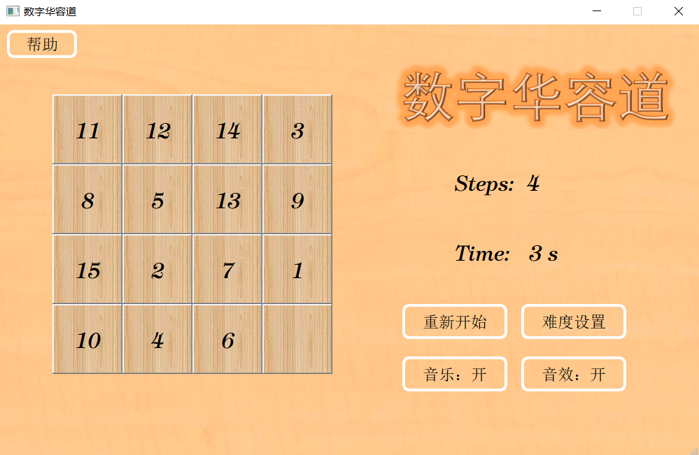

# Sliding-Block-Puzzle

<p align="center">
    
</p>

Sliding Block Puzzle (数字华容道) Game by Qt.

## Demo





## Development Tool

```
Qt 5.14.2
```

## To Do

- [x] 数字华容道**可解性**保证(Solvable)
  - 数学证明 [**置换的奇偶性**]：本项目场景中，当且仅当**逆序数**为**偶数**时，数字华容道**可解**。
  - 利用归并排序 (MergeSort) 求解逆序数，用于判断可解性。
- [ ] 自动求解

## NOTE

本项目原为南开大学2021级C++课程大作业，原项目位于 [Gitee](https://gitee.com/InfinityUniverse0/SlidingBlockPuzzle) 。
