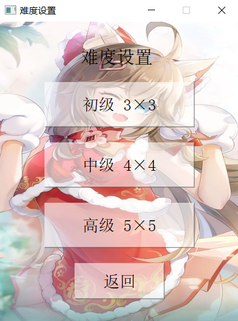

# Sliding-Block-Puzzle

<p align="center">
    
</p>

Sliding Block Puzzle (数字华容道) Game by Qt.

## Demo




## Development Tool

```
Qt 5.14.2
```

## NOTE

本项目原为南开大学2021级C++课程大作业，原项目位于 [Gitee](https://gitee.com/InfinityUniverse0/SlidingBlockPuzzle) 。
